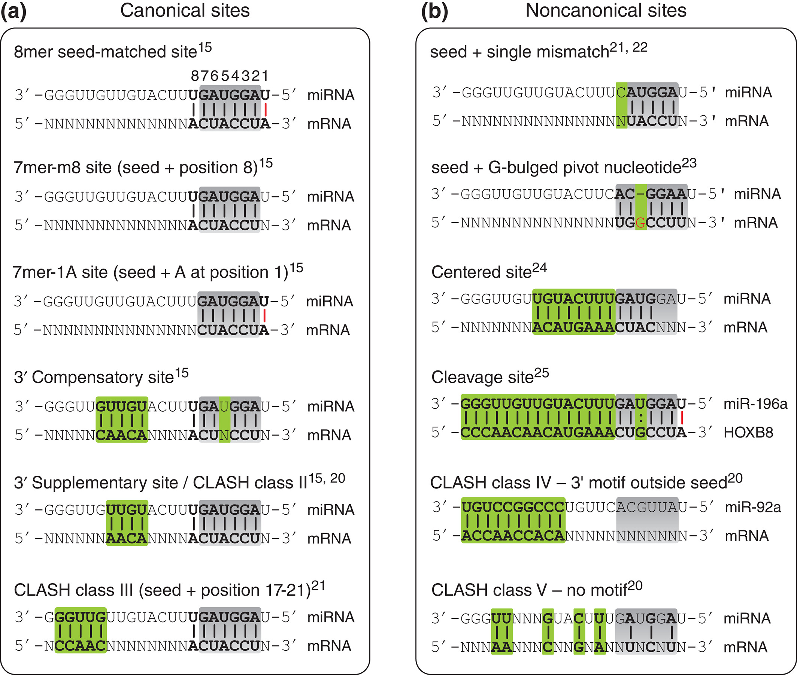

*(Mapping the Human miRNA Interactome by CLASH Reveals Frequent Noncanonical Binding, 2013, https://doi.org/10.1016/j.cell.2013.03.043)*

## Type I

only seed (2-7) region

## Type II

**strongest**

seed (2-7) + 13–16

## Type IIII

seed (2-7) + 17-21

## Type IV

motif outside seed

## Type V

distributed

