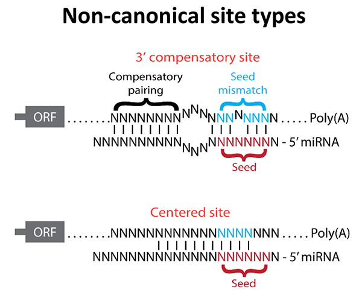
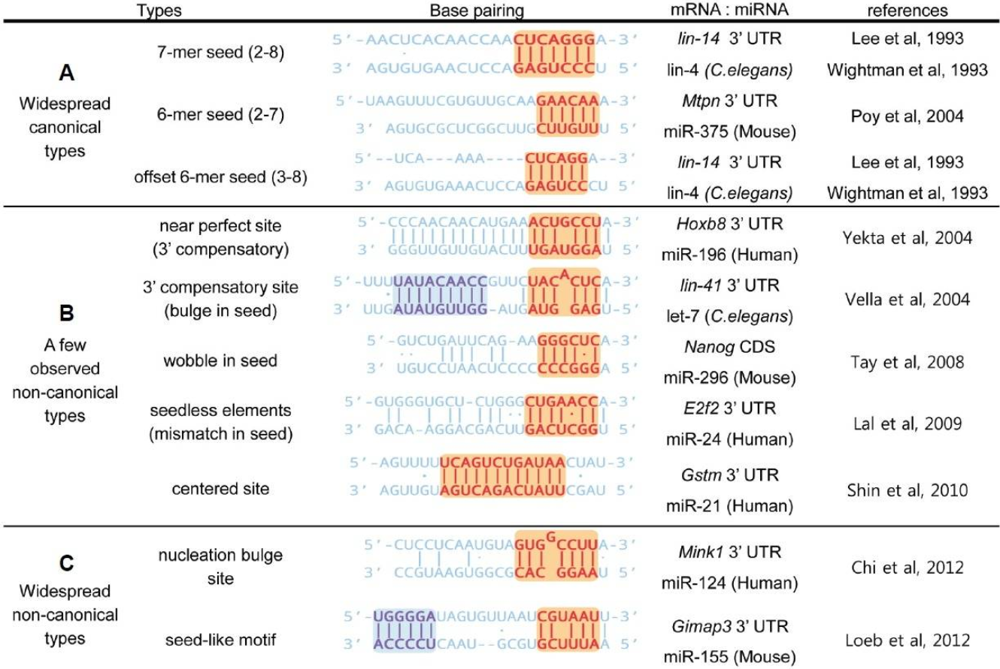
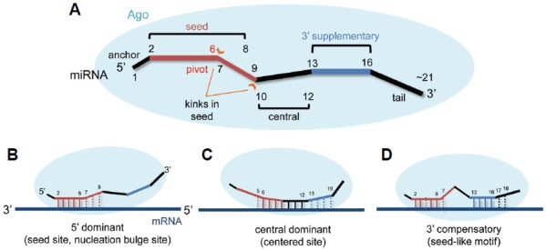

# Canonical Vs. Noncanonical Interactions

Canonical sites
- Seed

Non canonical sites
- 3' supplementary
- compensatory (Grimson et al., 2007; Lian et al., 2009)
- Seedless (Lal et al., 2009)

## Canonical Sites

## References

>Although seed-mediated interactions constitute the largest class in our data, **only around 37% of seed interactions** involve uninterrupted Watson-Crick base pairing. This figure seemed surprisingly low but is consistent with the many observations of endogenous noncanonical miRNA targets.

>To provide an overview of the key features of miRNA-mRNA interactions, we analyzed miRNA base-pairing patterns by cluster analysis. As expected, the most frequent miRNA interaction site with a target is the seed, and base pairing in this region is detected for more than half of the interactions. However, seed interactions alone are found in only a relatively small fraction of identified targets (class I, 19%). Defined classes II–III agree with previously described 3′ supplementary and compensatory sites ([Grimson et al., 2007](https://www.ncbi.nlm.nih.gov/pmc/articles/PMC3650559/#bib17); [Lian et al., 2009](https://www.ncbi.nlm.nih.gov/pmc/articles/PMC3650559/#bib31)).

*(Mapping the human miRNA interactome by CLASH reveals frequent noncanonical binding, 2013, https://doi.org/10.1016/j.cell.2013.03.043)*

---

Noncanonical sites are sites of interaction between a mRNA and a miRNA that do not involve the canonical pairing in the seed region (positions 2 - 7) of the miRNA. They are of two types:
- A 3' compensatory site is one in which strong 3' pairing (consequential miRNA-target complementarity outside the seed region) compensates for an imperfect seed match (Friedman et al., 2009).
- A centered site is one that lacks perfect seed pairing and 3'-compensatory pairing but instead has 11-12 contiguous Watson-Crick pairs to miRNA positions 4-15. These are identified only in the reference species and therefore include no information about conservation.

*(Predicting effective microRNA target sites in mammalian mRNAs, 2015, https://doi.org/10.7554/eLife.05005)*

---

>However, since a 6 nt match presents on average every ∼4,000 nt, likely to be occurred often by chance, such strategies still suffer from both false-positive (∼40–66%) and false-negative predictions (∼50–70%) ([Mourelatos, 2008](https://www.ncbi.nlm.nih.gov/pmc/articles/PMC4870184/#b55-molce-39-5-375)) even in the usage of microarray or proteomic approaches ([Baek et al., 2008](https://www.ncbi.nlm.nih.gov/pmc/articles/PMC4870184/#b3-molce-39-5-375); [Selbach et al., 2008](https://www.ncbi.nlm.nih.gov/pmc/articles/PMC4870184/#b66-molce-39-5-375)). Furthermore, seed-pairing rules cannot identify non-canonical target sites, which have been reported as functional ([Brodersen and Voinnet, 2009](https://www.ncbi.nlm.nih.gov/pmc/articles/PMC4870184/#b8-molce-39-5-375))

*(MicroRNA Target Recognition: Insights from Transcriptome-Wide Non-Canonical Interactions, 2016, https://doi.org/10.14348/molcells.2016.0013)*

