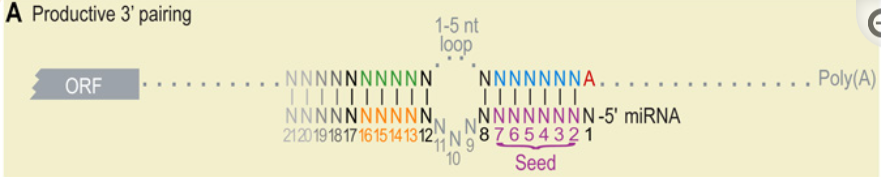

# 3′ Supplementary Pairing

This feature looks for additional Watson-Crick pairing at nucleotides 13-16

---

> Overall, consequential pairing preferentially involved Watson-Crick pairing to miRNA nucleotides 12–17, most especially nucleotides 13–16

*(MicroRNA Targeting Specificity in Mammals: Determinants beyond Seed Pairing, 2007, https://doi.org/10.1016/j.molcel.2007.06.017)*

---
These features are captured in a 3′-pairing score, which awards one point for each contiguous Watson–Crick pair matching miRNA nucleotides 13–16 and a half point for each contiguous pair extending the pairing in either direction. Pairing segments offset from the miRNA are then penalized by subtracting a half point for each nucleotide of offset beyond ±2 nucleotides from the register directly opposite the miRNA, and then sites are assigned the score of the highest scoring pairing segment ([Grimson et al. 2007](https://genome.cshlp.org/content/19/1/92.long#ref-9)).

Sites with scores ≥3 display modestly increased efficacy and conservation ([Grimson et al. 2007](https://genome.cshlp.org/content/19/1/92.long#ref-9)).

*(Most mammalian mRNAs are conserved targets of microRNAs, 2009, https://doi.org/10.1101/gr.082701.108)*

---

## Other Notes:

3' pairing can help compensate for imperfect seed pairing ([Doench and Sharp, 2004](https://www.ncbi.nlm.nih.gov/pmc/articles/PMC3800283/#R4); [Brennecke et al., 2005](https://www.ncbi.nlm.nih.gov/pmc/articles/PMC3800283/#R3))
