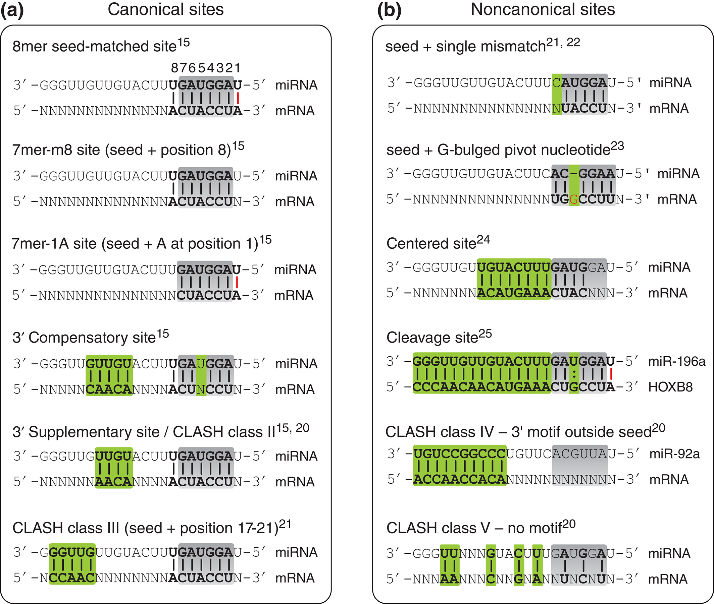

# Canonical or Non Canonical Seed Type

[[# Canonical or Non Canonical Seed Type]]

A column in dataframe that contains the categorical data of:

- Canonical
- Non Canonical

seed types as seen below.

Idea is from CLASH

---

In agreement with previous findings, upregulation was highest among those targets that contained a seed match and were located in the 3′ UTR ([Figures 2](https://www.ncbi.nlm.nih.gov/pmc/articles/PMC3650559/figure/fig2/)D and [​andS2C–S2F).S2](https://www.ncbi.nlm.nih.gov/pmc/articles/PMC3650559/figure/figs2/)C–S2F). Targets lacking a canonical seed match were also upregulated, on average half as efficiently as the seed-containing targets ([Figure S2](https://www.ncbi.nlm.nih.gov/pmc/articles/PMC3650559/figure/figs2/)F).

*(Mapping the Human miRNA Interactome by CLASH Reveals Frequent Noncanonical Binding, 2013, https://doi.org/10.1016/j.cell.2013.03.043)*
