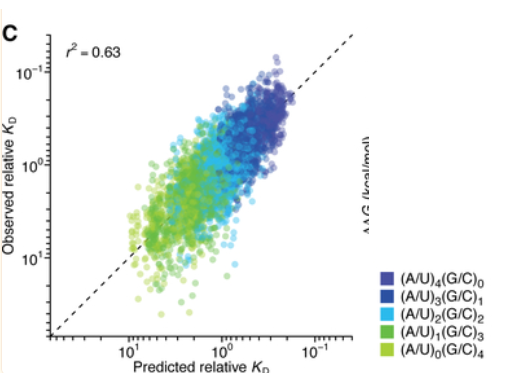

# Flanking Dinucleotides

The identity of dinucleotides immediately flanking the seed match

flanking dinucleotides contribution ranking:
**A ≈ U > C > G**

---

>AU-rich nucleotide composition immediately flanking miRNA sites has long been associated with increased site conservation and efficacy in cells ([13](https://www.ncbi.nlm.nih.gov/pmc/articles/PMC7051167/#R13), [31](https://www.ncbi.nlm.nih.gov/pmc/articles/PMC7051167/#R31), [32](https://www.ncbi.nlm.nih.gov/pmc/articles/PMC7051167/#R32))

>A and U nucleotides each enhanced affinity, whereas G nucleotides reduced affinity, and C nucleotides were intermediate or neutral ([Fig. 4C](https://www.ncbi.nlm.nih.gov/pmc/articles/PMC7051167/figure/F4/), right).

>the identity of the 5′ flanking dinucleotide, which must come into close proximity with the central RNA-binding channel of AGO ([7](https://www.ncbi.nlm.nih.gov/pmc/articles/PMC7051167/#R7)), contributed more to binding affinity than did the 3′ flanking sequence ([Fig. 4C](https://www.ncbi.nlm.nih.gov/pmc/articles/PMC7051167/figure/F4/), right).

*Figure 4C*

*(The biochemical basis of microRNA targeting efficacy, 2019, https://doi.org/10.1126/science.aav1741)*

---

**The effect of the flanking-dinucleotide context was of such magnitude that it often exceeded the affinity differences observed between miRNA-site types.**

- at least one 6-nt canonical site in its most favorable context had greater affinity than that of the 8mer site in its least favorable context

## Reference Notes

>Nucleotides immediately flanking the functional sites were highly enriched for A and U content relative to the nonfunctional sites. This phenomenon of high local AU content was important in the immediate vicinity of the site and then fell off quickly.

*(MicroRNA Targeting Specificity in Mammals: Determinants beyond Seed Pairing, 2007, https://doi.org/10.1016/j.molcel.2007.06.017)*
