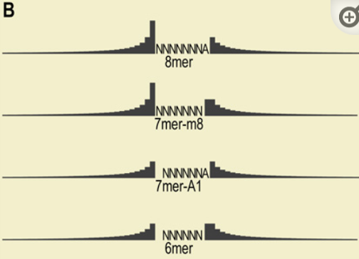

# Local AU Context

This feature checks the transcript AU content 30nt upstream and downstream of predicted site

## Biological Intuition:

**mRNAs that need to be regulated (by miRNAs) would have AU-rich 3' UTR's.**
Why?
- AU rich environment of UTRs translate into weaker mRNA 2nd structure in the vicinity of the site, increasing accessibility.

**mRNAs that evade regulatory targeting would benefit from increased GC content.**
Why?
- GC rich environment would make newly emerged (by mutations) MRE sites less likely to function.

## How to Implement?

We developed a rubric that considered the composition of residues 30 nt upstream and 30 nt downstream of the seed site, with weighting tailing off with the inverse of the distance from the seed site ([Figure 3B](https://www.ncbi.nlm.nih.gov/pmc/articles/PMC3800283/figure/F3/)). The 7mers scoring in the top quartile by our rubric appeared at least **as effective as 8mers scoring in the bottom two quartiles**, illustrating the substantial influence of local AU composition for site efficacy ([Figures 3C](https://www.ncbi.nlm.nih.gov/pmc/articles/PMC3800283/figure/F3/)).

Figure 3B: Weighting of the AU composition for the different types of sites. For each position within 30 nt upstream and downstream of the site, the presence of an A or a U increased the score for the site by an amount proportional to the height of the bar for that nucleotide. When moving away from the site, the weight (bar height) decreased with the inverse of the distance from the site. For example, the weight of the nucleotides downstream of the 8mer were 1/2, 1/3, 1/4, 1/5 … that of the nucleotide upstream of the 8mer.

*(MicroRNA Targeting Specificity in Mammals: Determinants beyond Seed Pairing, 2007, https://doi.org/10.1016/j.molcel.2007.06.017)*
