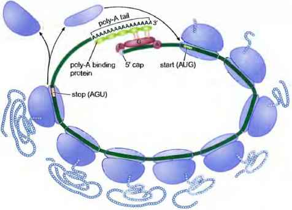

> When examining whether the location of the site within the remainder of the 3'UTR influenced performance, we found that sites residing near the two ends of long UTRs generally were more effective than those near the center ([Figures 5A](https://www.ncbi.nlm.nih.gov/pmc/articles/PMC3800283/figure/F5/); _P_ = 0.0011, Pearson correlation).

*(MicroRNA Targeting Specificity in Mammals: Determinants beyond Seed Pairing, 2007, https://doi.org/10.1016/j.molcel.2007.06.017)*

---

*Figure 5A: Fraction of sites associated with repression for 8mers residing at different positions in 3'UTRs. UTRs of at least 1300 nt with single 8mer sites were split into 10 equally spaced bins based on the relative position of the site (distance from stop codon divided by the UTR length). For each bin, the point is plotted that corresponded to the mean site position and the fraction of messages downregulated at a threshold _P_ < 0.05 on the microarray. The lines are the least-squares fit to all the data, using a model assuming equal effects from both ends of the UTR.*

---

>UTR quartiles near the ORF and near the poly(A) tail were more hospitable for effective targeting than were the two central quartiles. This effect was most pronounced for longer UTRs (>1300 nt).

*(MicroRNA Targeting Specificity in Mammals: Determinants beyond Seed Pairing, 2007, https://doi.org/10.1016/j.molcel.2007.06.017)*

## Biological intuition:

The increased efficacy of sites falling near the ends of long UTRs might be attributed either to proximity with the translation machinery or to increased site accessibility. Within the circularized structures of mRNAs, with the poly(A) tail interacting with the 5' cap, sites located in the middle of long 3'UTRs would be furthest from the translational machinery, whereas sites closer to the ORF and 5'UTR might be better situated to interact with the translation machinery and hence induce repression.

**Proximity would be greater within the 5'UTR or ORF, but such sites would face ribosome interference, leaving sites near the ends of the 3'UTR as the most optimal.**

*Figure: A model for the circularization of eukaryotic mRNA, with ribosomes (blue) working on it.*