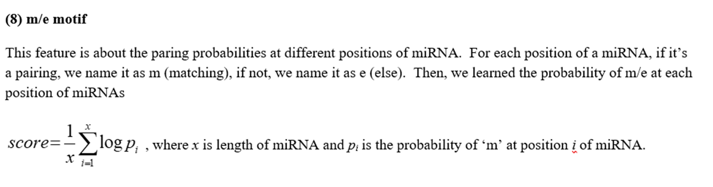

# Common Features of TargetScan and Tarpmir

- Seed match
- Folding energy (calculated using different modules)
- local AU content
- length of the target mRNA region (TargetScan uses log value)
- seed kmer type (8mer, 7mer-A1 etc.)
- 3' supplementary pairing

# Features of TargetScan

The table below contains all the features of TargetScan. **Bolded features** are used in the final TargetScan algorithm. The rest are discarded.

| Feature                                | Description                                                                                                                                                                                                                                                                                                                            |
|----------------------------------------|----------------------------------------------------------------------------------------------------------------------------------------------------------------------------------------------------------------------------------------------------------------------------------------------------------------------------------------|
| **[[3′-UTR target-site abundance]]**       | **Number of sites in all annotated 3′ UTRs (**[**Arvey et al., 2010**](https://elifesciences.org/articles/05005#bib5)**;** [**Garcia et al., 2011**](https://elifesciences.org/articles/05005#bib60)**)**                                                                                                                              |
| ORF target-site abundance              | Number of sites in all annotated ORFs ([Garcia et al., 2011](https://elifesciences.org/articles/05005#bib60))                                                                                                                                                                                                                          |
| **Predicted seed-pairing stability**   | **Predicted thermodynamic stability of seed pairing (**[**Garcia et al., 2011**](https://elifesciences.org/articles/05005#bib60)**)**                                                                                                                                                                                                  |
| **sRNA position 1**                    | **Identity of nucleotide at position 1 of the sRNA**                                                                                                                                                                                                                                                                                   |
| **sRNA position 8**                    | **Identity of nucleotide at position 8 of the sRNA**                                                                                                                                                                                                                                                                                   |
| Site position 1                        | Identity of nucleotide at position 1 of the site                                                                                                                                                                                                                                                                                       |
| **Site position 8**                    | **Identity of nucleotide at position 8 of the site**                                                                                                                                                                                                                                                                                   |
| Site position 9                        | Identity of nucleotide at position 9 of the site ([Lewis et al., 2005](https://elifesciences.org/articles/05005#bib147); [Nielsen et al., 2007](https://elifesciences.org/articles/05005#bib213))                                                                                                                                      |
| Site position 10                       | Identity of nucleotide at position 10 of the site ([Nielsen et al., 2007](https://elifesciences.org/articles/05005#bib213))                                                                                                                                                                                                            |
| **[[Local AU Content]]**                   | **AU content near the site (**[**Grimson et al., 2007**](https://elifesciences.org/articles/05005#bib78)**;** [**Nielsen et al., 2007**](https://elifesciences.org/articles/05005#bib213)**)**                                                                                                                                         |
| **[[3′ supplementary pairing]]**           | **Supplementary pairing at the miRNA 3′ end (**[**Grimson et al., 2007**](https://elifesciences.org/articles/05005#bib78)**)**                                                                                                                                                                                                         |
| Distance from stop codon               | log10(Distance of site from stop codon)                                                                                                                                                                                                                                                                                                |
| **[[Site Accessibility]]** | **log**10**(Probability that a 14 nt segment centered on the match to sRNA positions 7 and 8 is unpaired)**                                                                                                                                                                                                                            |
| **[[Minimum distance]]**                   | **log**10**(Minimum distance of site from stop codon or polyadenylation site) (**[**Gaidatzis et al., 2007**](https://elifesciences.org/articles/05005#bib59)**;** [**Grimson et al., 2007**](https://elifesciences.org/articles/05005#bib78)**;** [**Majoros and Ohler, 2007**](https://elifesciences.org/articles/05005#bib188)**)** |
| **Probability of conserved targeting** | **Probability of site conservation, controlling for dinucleotide evolution and site context (**[**Friedman et al., 2009**](https://elifesciences.org/articles/05005#bib58)**)**                                                                                                                                                        |
| 5′-UTR length                          | log10(Length of the 5′ UTR)                                                                                                                                                                                                                                                                                                            |
| **ORF length**                         | **log**10**(Length of the ORF)**                                                                                                                                                                                                                                                                                                       |
| **3**′-**UTR length**                  | **log**10**(Length of the 3′ UTR) (**[**Hausser et al., 2009**](https://elifesciences.org/articles/05005#bib90)**)**                                                                                                                                                                                                                   |
| 5′-UTR AU content                      | Fraction of AU nucleotides in the 5′ UTR                                                                                                                                                                                                                                                                                               |
| ORF AU content                         | Fraction of AU nucleotides in the ORF                                                                                                                                                                                                                                                                                                  |
| 3′-UTR AU content                      | Fraction of AU nucleotides in the 3′ UTR ([Robins and Press, 2005](https://elifesciences.org/articles/05005#bib219); [Hausser et al., 2009](https://elifesciences.org/articles/05005#bib90))                                                                                                                                           |
| **3**′**\-UTR offset-6mer sites**      | **Number of offset-6mer sites in the 3′ UTR (**[**Friedman et al., 2009**](https://elifesciences.org/articles/05005#bib58)**)**                                                                                                                                                                                                        |
| **ORF 8mer sites**                     | **Number of 8mer sites in the ORF (**[**Lewis et al., 2005**](https://elifesciences.org/articles/05005#bib147)**;** [**Reczko et al., 2012**](https://elifesciences.org/articles/05005#bib217)**)**                                                                                                                                    |
| ORF 7mer-m8 sites                      | Number of 7mer-m8 sites in the ORF ([Reczko et al., 2012](https://elifesciences.org/articles/05005#bib217))                                                                                                                                                                                                                            |
| ORF 7mer-A1 sites                      | Number of 7mer-A1 sites in the ORF ([Reczko et al., 2012](https://elifesciences.org/articles/05005#bib217))                                                                                                                                                                                                                            |
| ORF 6mer sites                         | Number of 6mer sites in the ORF ([Reczko et al., 2012](https://elifesciences.org/articles/05005#bib217))                                                                                                                                                                                                                               |

# Features of Tarpmir

The table below contains all the features of Tarpmir. **Bolded features** are used in the final Tarpmir algorithm. The rest are discarded.

Common features column indicates features that have been selected **significant** by all of the 4 ML models.

Common among other tools column indicates features that had been used in existing tools [(Peterson et al., 2014)](https://www.ncbi.nlm.nih.gov/pmc/articles/PMC5018371/#btw318-B36).

| All Considered Features                           | Description                                                                                                             | Common features | Common among other tools |
|---------------------------------------------------|-------------------------------------------------------------------------------------------------------------------------|-----------------|--------------------------|
| **[[Folding Energy]]**                                | minimal folding energy calculated by RNAduplex from ViennaRNA package                                                   | x               | x                        |
| **[[Seed Match]]**                                    | Perfect match between seed & MRE sequences                                                                              | x               | x                        |
| **[[Site Accessibility]]**                            | The accessibility is a measurement of whether the target site region in the mRNA sequence is open for miRNA to binding. | x               | x                        |
| **[[Local AU Content]]**                                    | AU content near the site (Grimson et al., 2007; Nielsen et al., 2007)                                                   | x               | x                        |
| **Stem Conservation**                             | The Stem conservation was calculated as the Average PhyloP sore in the miRNA-mRNA binding stem region.                  | x               | x                        |
| **Flanking Conservation**                         | calculated as the Average PhyloP sore in the 40nt upstream and 40nt downstream of the binding site.                     | x               | x                        |
| difference between stem and flanking conservation |                                                                                                                         |                 | x                        |
| **[[Feature Columns/ME Motif]]**                                     | pairing probabilities at different positions of miRNA                                                                   | x               |                          |
| **[[Total Number Of Paired Positions]]**          | Total number of paired positions for each miRNA-mRNA binding site.                                                      |                 |                          |
| **the length of the target mRNA region**                                                                                    | the length of miRNA binding target site region                                                                          | x               |                          |  |
| **the length of the largest consecutive pairs**                                                                            | Length of largest consecutive pairs between sRNA & mRNA                                                                 | x               |                          |
| **the position of the largest consecutive pairs relative to the miRNA 5′ end**                                            | the relative position of largest consecutive pairs to to 5’ end of miRNA                                                |                 |                          |
| the length of the largest consecutive pairs allowing 2 mismatches                                                           |                                                                                                                         |                 |                          |
| the position of the largest consecutive pairs allowing 2 mismatches                                                         |                                                                                                                         |                 |                          |
| **the number of paired positions at the miRNA 3′ end, where 3′ miRNA end was defined as the last 7 positions of the miRNA** | the number of paired positions in the miRNA 3’ end.                                                                     |                 |                          |
| the total number of paired positions in the seed region and the miRNA 3′ end                                                |                                                                                                                         |                 |                          |
| **the difference between the number of paired positions in the seed region and that in the miRNA 3′ end**                   | difference in # of paired positions between the seed region and the miRNA 3’ end region.                                | x               |                          |
| exon preference                                                                                                             |

# Biological Interpretation of m/e Motif:

>The inclusion of the m/e motif implied that there existed preferred matching positions shared by all miRNAs. The length of the target site was selected, showing the importance of the binding preference of miRNAs to mRNA regions with specific lengths. The length of the largest consecutive pairing positions mattered, which extended the concept of seed match, as seed match was just a simple case with a long consecutive pairing positions. The difference between the number of paired positions in the seed region and that in the miRNA 3′ end also suggested that the seed match may be unimportant, given a high-quality 3′ end region matching. This also supported the idea that a long consecutive matching region is critical for functional miRNA target sites.

*(TarPmiR: A new approach for microRNA target site prediction, 2016, https://doi.org/10.1093/bioinformatics/btw318)*

# What Are the Effects of New Columns of Tarpmir?

>The selected new features significantly improved the prediction accuracy of TarPmiR. To show the contribution of the new features to the accuracy of TarPmiR, we removed the seven new features and retrained random forests in TarPmiR. Compared with the original TarPmiR with 13 features, the recall and precision of the modified TarPmiR dropped 8.6% and 9.7%, respectively.

*(TarPmiR: A new approach for microRNA target site prediction, 2016, https://doi.org/10.1093/bioinformatics/btw318)*

# Extra Notes:

- **The accessibility** was proposed in *(Kertesz, M., Iovino, N., Unnerstall, U., Gaul, U. and Segal, E. (2007) The role of site accessibility in microRNA target recognition. Nature genetics, 39, 1278-1284)*.
- The **local AU content** reflects the transcript AU content 30nt upstream and downstream of predicted site.
- **Length of target mRNA region:** For example, if miRNA x binds to mRNA y and the binding site between x and y are 28 nts region on mRNA y, this feature is 28.

