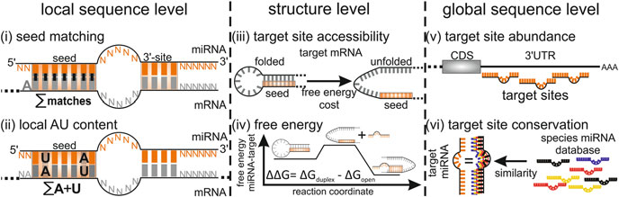
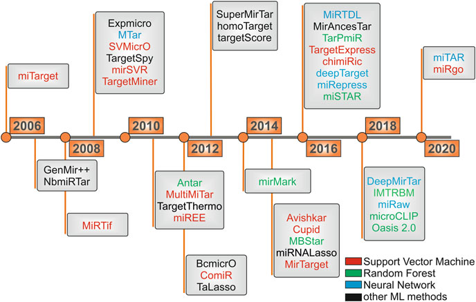
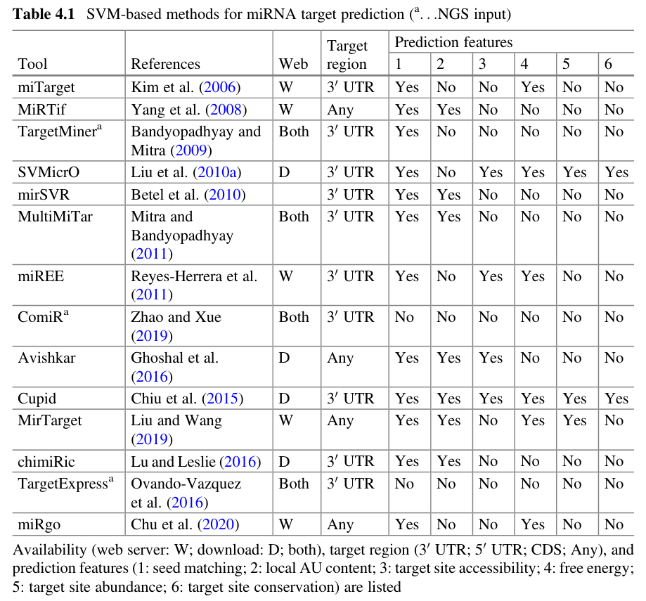
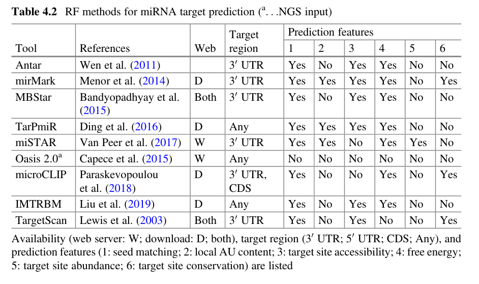
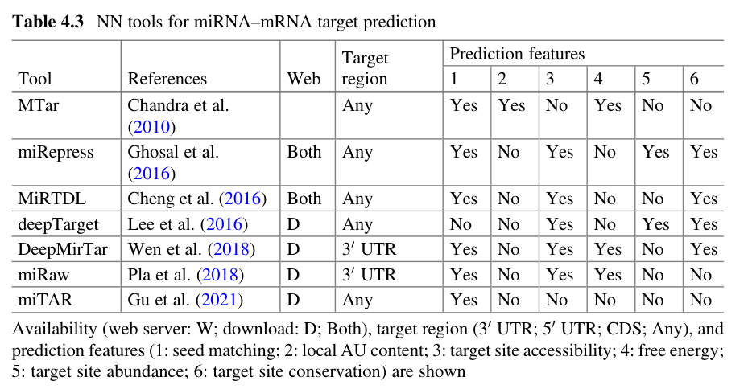

*(Machine Learning Based Methods and Best Practices of microRNA-Target Prediction and Validation, 2022, https://doi.org/10.1007/978-3-031-08356-3_4)*

---

Types of miRNAs in Cancer:
- oncomiR
- metastamiR
- tumor suppressor miRNAs

---

Fig. 4.2 Features for miRNA–mRNA target prediction. The scheme represents the main features
for miRNA–mRNA target prediction categorized in local sequence level: seed matching (1); local
AU content (2); in structure level: target site accessibility (3); free energy (4); global sequence level:
target site abundance (5); and target site conservation (6). The miRNAs are visualized in orange and
the mRNA target in gray

# Common Features for miRNA Target Prediction

Prediction tools are classified into six categories (Chu et al. 2020) based on six main features (Grimson et al. 2007; Peterson et al. 2014; Riolo et al. 2020):

- [Seed Match](../Feature%20Columns/Seed%20Match.md)
- [Local AU Content](../Feature%20Columns/Local%20AU%20Content.md)
- [Site Accessibility](../Feature%20Columns/Site%20Accessibility.md)
- [Folding Energy](../Feature%20Columns/Folding%20Energy.md)
- [3′-UTR Target-site Abundance](../Feature%20Columns/3′-UTR%20Target-site%20Abundance.md)
- [Conservation](../Feature%20Columns/Conservation.md)

## Seed Matching

Seed matching is the most common principle that is incorporated in many target prediction algorithms.

So far the majority of known miRNA–mRNA target sites can be classified into three types of canonical sites based on the seed matching feature (Benway and Iacomini 2018):
- 7mer1A
- 7mer-m8
- shorter seed matching regions
	- 6mer
	- 3' supplementary / compensatory

3' part of the miRNA (positions 13–16) corresponds to nucleotides of the transcript and can
compensate for a mismatch in the seed region (Grimson et al. 2007).

## Site Accessibility

The accessibility is calculated using the cost of free energy to unfold the mRNA at the seed region to bind the miRNA (Kertesz et al. 2007).

## Folding / Free Energy

free energy not only used in the unfolding likelihood of the mRNA but also as a general feature to define the stability of the miRNA–mRNA complex.
- Greater stability of miRNA/mRNA duplexes is reflected by lower free energy, which is influenced by other factors like :
	- length of mRNA,
	- formation of secondary structures at thermodynamic equilibrium
	- binding site accessibility
	- thermodynamic stability of miRNA–mRNA duplexes (Rojo Arias and Busskamp 2019)

## Target Site Abundance

The target site abundance is measured by how many target sites occur in the putative mRNA 3' UTR region and should be considered as a secondary feature to the seed matching or free energy feature (Garcia et al. 2011).

## Conservation

Conservation feature is based on the hypothesis that a miRNA target site, which is conserved across species, is the result of positive natural selection and this adds a functional meaning to the prediction. The method is based on the analysis of the UTR as well as the miRNA and includes
different “seed types” across different clades for their calculations (Simkin et al. 2020).

## 2 Categories of miRNA Target Prediction Tools

Currently, various tools for miRNA–mRNA target prediction are available that are roughly categorized into:
- feature driven (derived from characteristics of the mRNA sequence and/or miRNA–mRNA interaction)
- statistics driven (statistical inference based on ML) (Riolo et al. 2020)

# Machine Learning Based Algorithms for miRNA Target Prediction

miRNA–mRNA target prediction methods based on ML are trained to distinguish between target and non-target. Therefore the general outline is to identify for a set of validated targets (positive) and non-targets (negative) the putative binding sites of the miRNA, extract the feature information (free energy, seed matching, etc.), train the ML classifier and use the trained ML to decide for a separate set of miRNA–mRNA pairs between target and non-target (Parveen et al. 2019).
\
\

Fig. 4.3 Timeline for ML-based miRNA target prediction tools.
\
\
\

\

\

Positive target datasets:
- [miRBase](../miRNA%20Databases/miRBase.md) (Kozomara et al. 2019)
- [miRTarBase](../miRNA%20Databases/miRTarBase.md) (Hsu et al. 2011)
- DIANA [TarBase](../miRNA%20Databases/TarBase.md) (Karagkouni et al. 2018)
- miRecords (Xiao et al. 2009) **not working**

**The positive dataset can introduce bias caused by cell type, condition, and laboratory approaches (Schafer and Ciaudo 2020).**

# Best Practices for miRNA Target Prediction

## Validation of miRNA Target Prediction

As a general approach, four criteria should be fulfilled to validate a miRNA–mRNA target pair in the biological model of interest (Thomson et al. 2011):
- Co-expression of miRNA and predicted target mRNA must be demonstrated
- A direct interaction between the miRNA of interest and a specific region within the target mRNA must be proved
- Gain and loss of function experiments must be performed to demonstrate the regulatory mechanism
- The predicted changes in protein expression that are associated with modified biological functions should be demonstrated (Matkovich et al. 2011)
