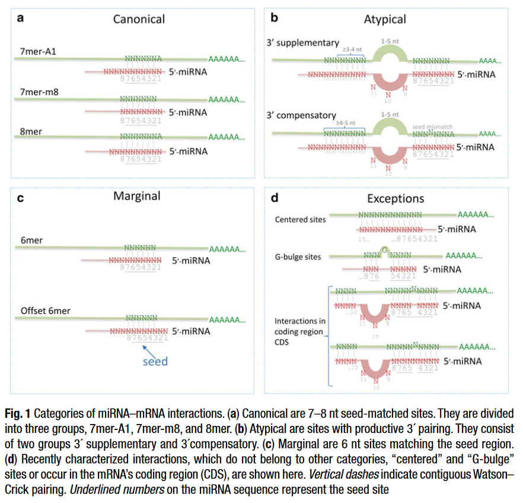

# Prediction of miRNA Targets

*(Prediction of miRNA targets, 2015, https://doi.org/10.1007/978-1-4939-2291-8_13)*

## Features

### Essential Features

- [Seed Match](../Feature%20Columns/Seed%20Match.md) of at least 7 nt

### Optional Features

These features are used to minimize false positives (increase specificity)

- [Folding Energy](../Feature%20Columns/Folding%20Energy.md)
- evolutionary conservation of seed site
- [Site Accessibility](../Feature%20Columns/Site%20Accessibility.md)
- [Flanking Dinucleotides](../Feature%20Columns/Flanking%20Dinucleotides.md)
- [MREs in close proximity](../Feature%20Columns/MREs%20in%20close%20proximity.md)

## Categories

Canonical sites
- 8mer
- 7mer-A1
- 7mer-m8

Marginal sites
- 6mer
- Offset 6mer (refer to 6mer starting from the third nucleotide)

Atypical sites
- 3' supplementary (Watson–Crick pairing usually centering miRNA nucleotides 13–16 supplements a 6–8 nt seed site.)
- 3' compensatory (Watson–Crick pairing usually centering on miRNA nucleotides 13–16 can compensate for a seed mismatch and thereby create a functional site) *(MicroRNAs: Target recognition and regulatory functions, 2009, https://doi.org/10.1016/j.cell.2009.01.002)*

Other sites
- Centered (lack both perfect seed pairing and 3′-compensatory pairing, and instead have 11–12 contiguous Watson–Crick pairs to miRNA nt 4–15) *(Expanding the microRNA targeting code: Functional sites with centered pairing, 2010, https://doi.org/10.1016/j.molcel.2010.06.005)*
- G bulge (Unpaired G found between 5th and 6th nucleotides of seed sequence, conserved in mice) *(An alternative mode of microRNA target recognition, 2012, https://doi.org/10.1038/nsmb.2230)*

---

Brennecke et al. separated target sites into 2 groups based on experimental evidence
- 5' dominant (sites that depend critically on the pairing to the miRNA 5′ end)
- 3' compensatory (include seed matches of four to six base pairs and seeds of seven to eight bases that contain G–U base pairs, single nucleotide bulges, or mismatches and a extensive pairing to the 3′end of the miRNA)

*(Principles of microRNA-target recognition, 2005, https://doi.org/10.1371/journal.pbio.0030085)*
