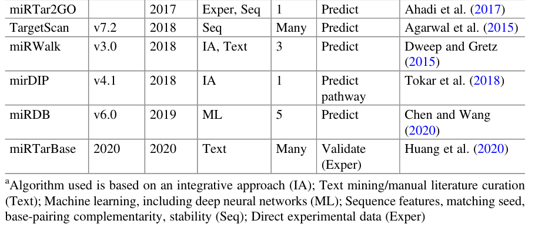

# Turning Data to Knowledge, Online Tools, Databases, and Resources in microRNA Research

*(Turning Data to Knowledge: Online Tools, Databases, and Resources in microRNA Research, 2022, https://doi.org/10.1007/978-3-031-08356-3_5)*

## miRNA-Target Prediction Tools and Resources

\
\
Table 5.1 Selected miRNA-target prediction online tools and validation resources

## miRNA-Target Prediction Validation Databases

**DIANA [TarBase](../miRNA%20Databases/TarBase.md) v8 (1/2018)** database reports on experimentally supported miRNA targets. **This resource is considered a benchmark for several prediction methods.** The current TarBase reports on ~670 k unique miRNA-target pairs.

**[miRTarBase](../miRNA%20Databases/miRTarBase.md) 2020 (1/2020)** is a comprehensive resource of experimentally validated miRNA-target interactions (denoted MTIs). miRTarBase is a rich experimentally validated MTI database with comprehensively annotated information (Huang et al. 2020).

## miRNA Sponging: ceRNA and lncRNA Interactions

**miRSponge (9/2015)** is a manually curated database that provides experimentally supported resources for miRNA sponge interactions. miRSponge reports on 298 miRNA–ceRNA interactions in humans that occur between miRNA, pseudogenes, lncRNAs, circRNAs, and human viruses. The database covers 11 species with ~600 miRNA–ceRNA interactions that are supported by ~1200 published articles.

**DIANA-LncBase v.2 (1/2016)** is a database of experimentally supported and in silico predicted MBS in lncRNAs. DIANA-LncBase is an extensive collection of miRNA–lncRNA interactions with ~70 k experimentally supported interactions derived from publications and the analysis of ~150 AGO CLIP-Seq libraries.
