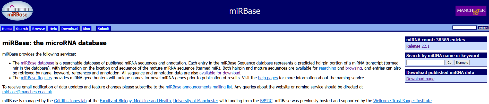

# miRBase

*(miRBase: From microRNA sequences to function, 2019, https://doi.org/10.1093/nar/gky1141)*
\
Link: [miRBase](https://mirbase.org/)

---

The latest release of miRBase (v22) contains microRNA sequences from 271 organisms: 38 589 hairpin precursors and 48 860 mature microRNAs.
