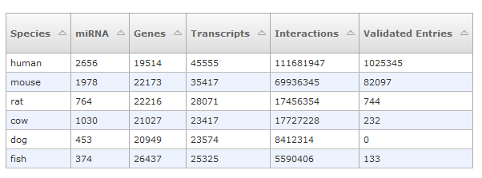
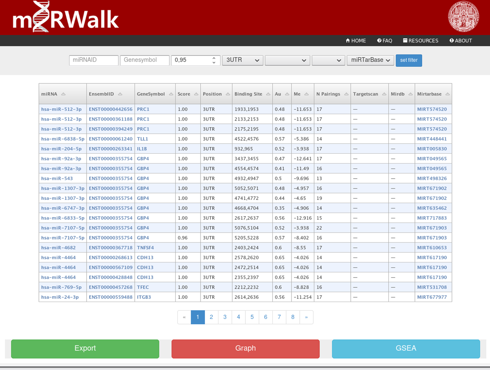

*(miRWalk: An online resource for prediction of microRNA binding sites, 2018, https://doi.org/10.1371/journal.pone.0206239)*

Link: http://mirwalk.umm.uni-heidelberg.de/

# Statistics

# Sample Results

# Sample Results From Downloads

miRNA	mRNA	Genesymbol	binding_site	duplex	binding_probability
hsa-miR-24-3p	NM_001256426	PDLIM5	64,89	TGGCTCAGTTCAGCAGGAACAG#TTTCTGTCATTGGACTTTGAGCCAT#(((((((((((((((((((...#)))))))...))))))..)))))).	0.9230769230769231

# Features

- Whole exome, instead of only focusing to 3' UTR
- Their human predictions of 5' UTR, CDS and 3' UTR are readily available in their [resources page](http://mirwalk.umm.uni-heidelberg.de/resources/) (~16gb total)
- Uses TarpmiR algorithm and 2 other databases (TargetScan and miRDB) to fine tune predictions
- Validates predictions from [miRTarBase](miRTarBase.md)
